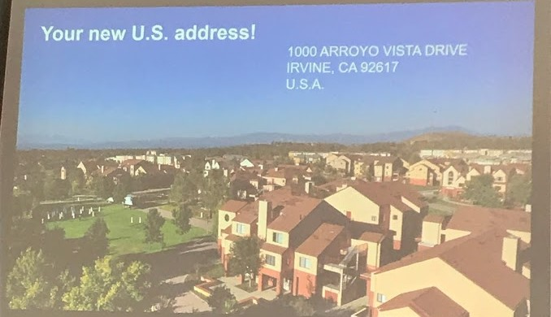

# Paper Submission

---

## Feel blessed and find the courage to make life a blessing! 

---

## Good time with foreign friend

---

## Marathon Ceremony at CityU in Hong Kong

---

## Golden Gate Bridge, San Francisco, United States of America

---

# Working Hard in 2022!!!! 加油鸭！！！！

---

# USA Address 

  

---

[PhD/PostDoc/有奖Master及其他学术相关openings](https://www.1point3acres.com/bbs/forum-173-1.html)

[教授之间相互交流专区](https://www.1point3acres.com/bbs/forum.php?mod=forumdisplay&fid=328)

---

[Philip Guo - A Five-Minute Guide to Ph.D. Program Applications](https://pg.ucsd.edu/PhD-application-tips.htm)

[Andrej Karpathy - A Survival Guide to a PhD](http://karpathy.github.io/2016/09/07/phd/)

[Jiayi Weng - 申请回忆录](https://trinkle23897.github.io/posts/application)

---

Richard Hamming - You and Your Research: [in English](http://www.cs.virginia.edu/~robins/YouAndYourResearch.html), [in Chinese](http://www.yidianzixun.com/article/0LZ4zQZV)

[计算机视觉 | 哥大读博五年总结](https://zhuanlan.zhihu.com/p/338193330)

---

[Chosen PhD School:](http://csrankings.org/#/index?all&us)

**USA**:

1. [California Institute of Technology](https://gradoffice.caltech.edu/admissions/FAQ)
2. [Univ. of California, Davis](https://grad.ucdavis.edu/english-language-examinations)
3. [University of Wisconsin Madison](https://grad.wisc.edu/apply/requirements/)
4. [The University of Chicago](https://grad.uchicago.edu/admissions/apply/english-language-requirements/)
5. [Rutgers University](https://grad.rutgers.edu/admissions/international-students)
6. [Boston University](https://www.bu.edu/eng/prospective-graduate/apply/international-students/)
7. [Johns Hopkins University](https://engineering.jhu.edu/admissions/graduate-admissions/full-time-programs/how-to-apply/international-students/)
8. [Rice University](https://graduate.rice.edu/admissions/application-faq)
9. [Oregon State University](https://gradschool.oregonstate.edu/admissions/international)
10. [Northwestern University](https://www.mccormick.northwestern.edu/computer-science/academics/graduate/admissions/)
11. [University of Massachusetts at Amherst](https://www.umass.edu/graduate/apply/international-applicants)

**Canada**:

1. [University of Waterloo](https://uwaterloo.ca/graduate-studies-postdoctoral-affairs/future-students/applying-graduate-school/before-you-apply/admission-and-english-language-proficiency-requirements)
2. [University of British Columbia](https://www.grad.ubc.ca/prospective-students/graduate-degree-programs/phd-computer-science)

**UK/Europe**:

1. [University of Oxford](https://www.ox.ac.uk/admissions/graduate/applying-to-oxford/application-guide/qualifications-languages-funding#content-tab--4)
2. [The University of Edinburgh](https://www.ed.ac.uk/studying/postgraduate/applying/your-application/entry-requirements/english-requirements/approved-universities)

**Hong Kong**：

1. CUHK
2. HKUST
3. HKU
4. CityU 

**Others need English Language Proof**:

1. [The University of Washington](https://grad.uw.edu/admission/understanding-the-application-process/international-applicant-information/english-proficiency-tests/)
2. [Univ. of Illinois at Urbana-Champaign](https://grad.illinois.edu/admissions/instructions/04c)
3. [Northeastern University](https://coe.northeastern.edu/academics-experiential-learning/graduate-school-of-engineering/graduate-admissions/)
4. [Columbia University in the City of New York](https://www.gradengineering.columbia.edu/faq/standardized-test-scores)
5. [Ohio State University](http://gpadmissions.osu.edu/intl/additional-requirements-to-apply.html)
6. [University of Colorado Boulder](https://www.colorado.edu/graduateschool/admissions/prepare-apply/international-students/english-proficiency-requirements)
